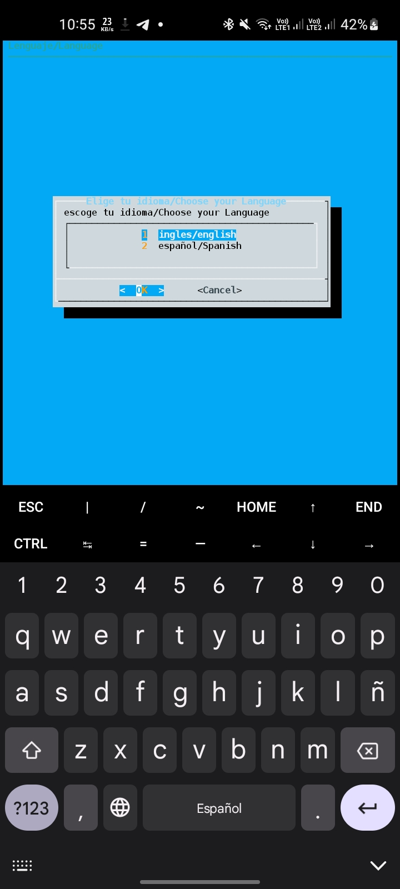
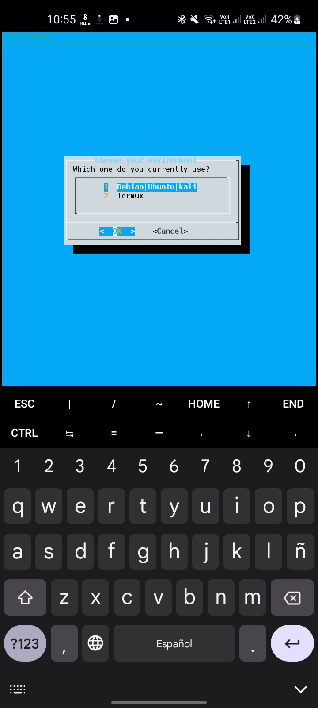

<center> <h1>Linux Atajos de teclado</h1> </center>


* [Instalacion](#instalacion)
* [Tipos de shell](#tipos-de-shell)
* [Idiomas](#idiomas)
    - [Español](#español)
    - [Ingles](#ingles)
* [Entornos](#entornos)
* [Documentacion](#documentacion)


## **_instalacion_**
---
para realizar la instalacion se nesecita clonar el repositorio haciendo uso de la herramienta *Git* con el siguiente comando
```
git clone https://github.com/RchrdAriza/TermuxAlias
```
En caso de no tener la herramienta _Git_ usar:
```shell 
apt-get install git
```
o
```shell
sudo apt-get install git
```
Luego despues de haber clonado el repositorio ejecute los siguientes comandos:
```
cd TermuxAlias
chmod +x script.sh
./script.sh
```
### **Listo!**
Ya tendria los atajos copiados en su archivo `.zshrc` o `.bashrc` dependiendo de su tipo de shell (Mas detalles sobre este tema en la seccion [Tipos de shell](#tipos-de-shell))

---

## **_Tipos de shell_**

Existen varios tipos de shell disponibles en los sistemas operativos Unix y Linux. Algunos de los más comunes son: Bash, que es la shell predeterminada en la mayoría de las distribuciones Linux y es muy popular debido a su amplia gama de características y herramientas; Zsh, que tiene características avanzadas como autocompletado de comandos y corrección ortográfica; KornShell (ksh), que es una shell que combina características de las shells Bourne y C; y Fish, que es una shell moderna y fácil de usar con características útiles como autocompletado y navegación en la historia del comando.

dentro del script está conteplada la posibilidad de que usted pueda tener cualquier de 2 tipos de shell tanto `Bash` como `Zsh`


---

## **_Idiomas_**

dentro del script existe la posibilidad de cambiar el idioma **de esto dependera el idioma de los atajos**




### **_Ingles_**
luego de haber escogido el ingles la interfaz del script pasara a mostrarse en ingles. **Esto no afectará el idioma definido por su sistema, solo el de los atajos!**


### **_Español_**
Luego de haber escogido el español la interfaz del script pasara a mostrarse en español. **Esto no afectará el idioma definido por su sistema, solo el de los atajos!**

---

## **_Entornos_**

El script cuenta con la opcion de elegir el entorno que se encuentra usando, Importante elegir correctamente (en el futuro se podrian estar agregando mas)

### **_Termux_**
En caso de ser usuario android con la terminal termux se omitira el comando "sudo" ya que este terminal no permite el uso de permisos root a menos que el dispositivo en realidad este rooteado

### **_Debian/Ubuntu/Kali_**
ya que estas distro de linux son tan parecidas entre ellaz no habra ningun problema

## **_Documentacion_**



